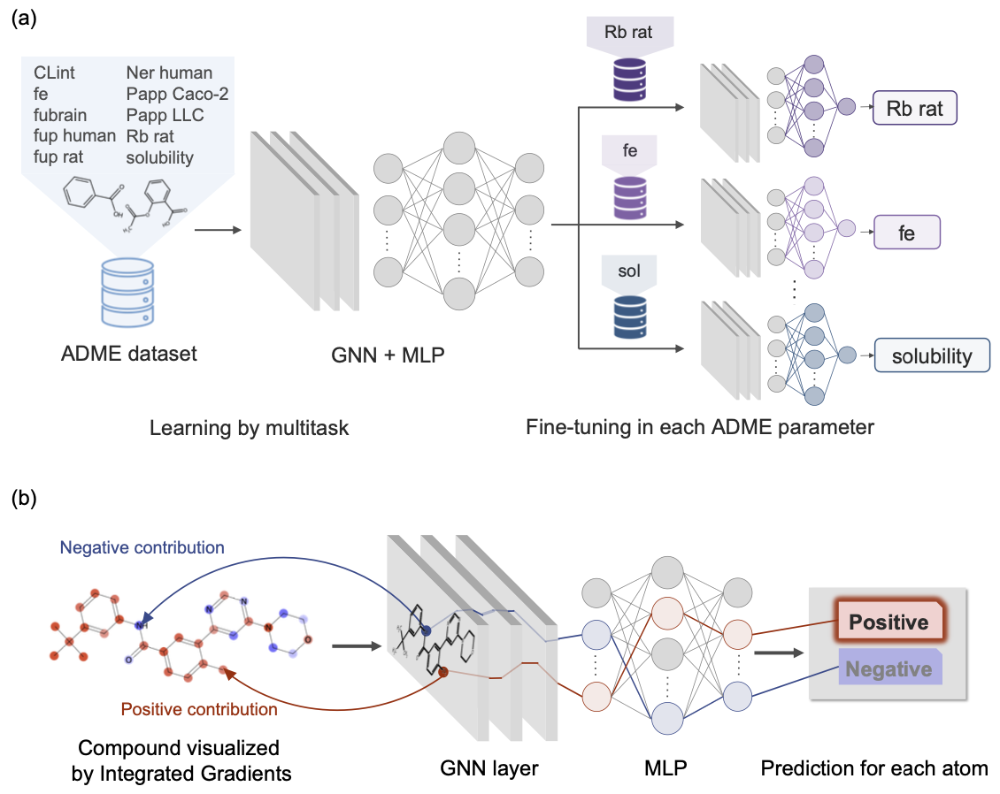

# ADME Multitask Training and Fine-Tuning

This README provides an overview of the environment setup and directory/configuration file organization required for multitask Graph Neural Network (GNN) training on ADME property prediction and subsequent fine-tuning, as employed in the paper **“Improving ADME Prediction with Multitask Graph Neural Networks and Assessing Explainability in Lead Optimization”** by Ito S. et al.  
By following this document, you will understand the essential requirements for data preparation and configuration placement. Detailed training and fine-tuning procedures are not covered here.



## Contact
- **Data Curator:** Shoma Ito  
- **Repository Manager:** Takuto Koyama (koyama.takuto.82j[at]st.kyoto-u.ac.jp)


## Table of Contents

1. [Prerequisites](#prerequisites)
2. [Directory Structure](#directory-structure)


## Prerequisites

- **kmol v1.1.9** [https://github.com/elix-tech/kmol.git]: the command-line tool for model training and evaluation

  Install required packages in a dedicated environment:

```bash
  git clone https://github.com/elix-tech/kmol.git
  cd kmol
  git checkout v1.1.9.2
  make create-env
  conda activate kmol
```

## Directory Structure

```
ADMET_MTFT/
├── dataset/
│   └── all_train_data_2022/
│       ├── standardize-drug_list/
│       │   └── ADME/
│       │       └── all_data/
│       │           └── log_data/           # per-target log-transformed values
│       └── multitask.csv                   # combined multitask labels and values
└── configs/
    └── accuracy_drug/
        └── adme/
            ├── multitask/                  # config files for GNN multitask training
            └── finetuning_learning_rate/  # config files for GNN fine-tuning

```

### Key subdirectories

- `dataset/all_train_data_2022`:
  - `standardize-drug_list/ADME/all_data/log_data`: per‑target log‑transformed values
  - `.../multitask.csv`: combined multitask labels and values

- `configs/accuracy_drug/adme`:
  - `multitask/`: config files for GNN multitask training
  - `finetunig_learning_rate/`: config files for GNN fine‑tuning

